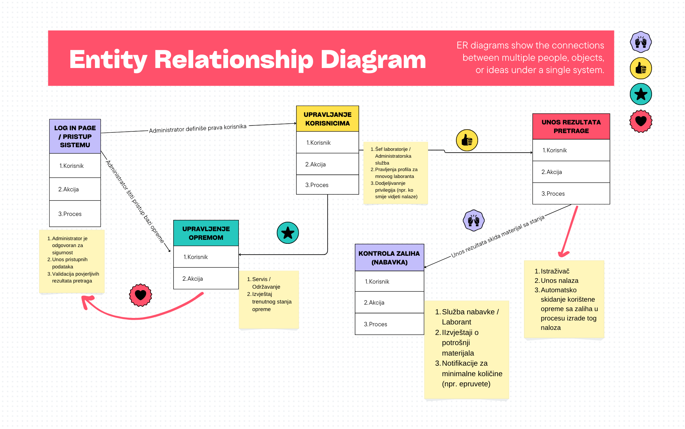

## **Stakeholder Map - Sistem za upravljanje laboratorijskom opremom**

### 1. Šta je Stakeholder Map?

#### 1.1 Definicija i koncept Stakeholder Mape

*Stakeholder Mapa* (u slobodnnom prevodu - Mapa zainteresovanih strana) - predstavlja proces identifikacije i kategorizacije osoba koje imaju interes u procesu razvoja i ishoda projekta [1].

U softverskom inžinjerstvu, "stakeholder" nije samo krajnji korisnik nego sve osobe koje mogu uticati na zahtjeve sistema.

#### 1.2 Zašto je Stakeholder Mapa toliko važna? 

*Mapiranje nam pomaže da otkrijemo potrebe koje nisu očigledne na prvi pogled.*

1. Identifikacije skrivenih funkcionalnih zahtjeva  
        Pomaže pri shvatanju administratorskih potreba, npr. adminu treba izvještaj o potrošnji a ne samo dugme za rezervaciju.

        Primjer: Krajnji korisnik (istraživač) vidi samo potrebu za akcijom "Rezervacije" dok administrator to gleda iz drugog ugla i vidi potrebu za npr. automatskim izveštajem o potrošnji materijala.

2. Upravljanja konfliktima  
        Različiti stakeholderi imaju i različite potrebe. Mapa drži balanas između različitih stakeholdera.

        Primjer: krajnji korisnik želi brzu pretragu dok admin želi maksimalnu sigurnost.

3. Prioriteta MVP  
        > *MVP (Minimum Viable Product - Minimalno održiv proizvod) u softverskom inženjeringu je početna verzija proizvoda koja sadrži samo najosnovnije funkcije potrebne za rješavanje ključnog problema korisnika. Služi za brzo lansiranje, validaciju ideje na tržištu uz minimalne troškove i prikupljanje povratnih informacija za dalji razvoj. [2]* 
        ---  
        Omogućava nam određivanje kritičnih potreba za prvu verziju proizvoda, a čije potrebe mogu čekati naredne verzije.   
        **Glvani cilj izrade Stakehloder Mape za ovu temu je osigurati da nijedan kritični zahtjev ne bude izostavljen (npr. sigurnost rezultata pretrage).**
   

### 2. Kategorije Stakeholdera

#### 2.1 Klasifikacija zainteresovanih strana 
Da bih nnapravio uvid u Stakeholdere, podijelio sam ih u 3 grupe:

1. Direktni korisnici:  
**Laborant** - Najviše koristiti sistem i radi stalni upis u bazu podataka. Koristi sistem za rezervaciju i unos rezultata.  
**Šef Laboratorije** - Naagleda radi Laaboranta, ima stalni uvid u termine i kontroliše resurse laboratorije.  

2. Podrška:  
**IT Administrator** - Osigurava rad baze podataka i aplikacije da rade beez prestanka.  
**Služba za servis** - Reaguje na kvarove i u slučaju kvara blokiraju opremu.  

3. Logistika:  
**Služba nabavke** - Prati izvještaj o potršnji materijala i vrše nabavku novog materijala.  

 

#### 2.2 Prikaz Entity Relationship Diagrama

*Ovaj dijagram prikazuje logičku povezanost između korisnika i ključnih kategorija sistema / aplikacije [3].*

### 3. Detaljna tabela Stakeholder Mape
*Ova tabela prikaazuje korisnike sistema, njihove uloge i očekivanja.*

| Stakeholder | Šta radi?| Glavni cilj | Očekivanja od sistema | MVP |
| :--- | :--- | :--- | :--- | :---: |
| **Istraživač / Laborant** | Koristi operemu iz labaratorije | Da završi posao u labaratoriji bez čekanja. | Unos rezultata napravljenih u labaratoriji | **Visok** |
| **Šef laboratorije** | Pita se za sve i ima maksimalnu kontorulu na laboratoriji | Da sve bude kako treba. | Da odobrava ili odbija termine i ima uvid u statistiku termina. | **Visok** |
| **Služba za serivs** | Popravljaju sve što ne valja. | Da spriječi kvarove. | Da blokiraju opremu tokom servisa. | **Srednji** |
| **Služba nabavke** | Nabalja opremu i unose u sistem. | Da nikad ne dođe do nestanka labaratorijskog pribora. npr. epruveta | Da imaju uvid u izvještaj o zalihama. | **Nizak** |
| **IT Administrator** | Održavanje servera gdje se nalazi sistem. | Sigurnost podataka. | Siguran login i redovan backup baze. | **Visok** |

---
 
*Kratak opis tabele i MVP*  
        Ako laborant nema mogućnost unosa podataka/rezultata u sistem, sistem je beskoristan jer on puni aplikaciju podacima i zato je MVP Visok. Šef laboratorije mora imati detaljan uvid u termine (da ne bi dolazilo do preklapanja) i da sve u laboratoriji bude kako treba. Služba za servis mora biti dostupna 24/7 ako npr. dođe do pucanja veze između apilkacije/sistema i baze podataka sistem prestaje raditi. IT Administrator u MVP-u je jako visok jer je potrebna zaštita podataka i bez toga ne smijemo čuvati stvarne rezultate pretrage.

 

### 4. Specifični zahtjevi za upravljanje laboratorijskom opremom

*Ova sekcija definiše konkretne funkcionalne i nefunkcionalne zahtjeve koji proizilaze iz analize stakeholdera. Svaki zahtjev je izveden direktno iz potreba identificiranih u Stakeholder Mapi (Sekcija 3) i služi kao osnova za budući Product Backlog.*

#### 4.1 Funkcionalni zahtjevi po stakeholderu

Funkcionalni zahtjevi opisuju **šta sistem mora raditi** — konkretne akcije i funkcionalnosti koje korisnici očekuju [1].

**a) Istraživač / Laborant**

| ID | Zahtjev | Opis | Prioritet |
|:---|:--------|:-----|:---------:|
| FR-01 | Rezervacija opreme | Laborant mora moći rezervisati opremu za određeni datum i vremenski termin putem kalendara. Sistem ne smije dozvoliti dvostruku rezervaciju istog resursa. | **Kritičan** |
| FR-02 | Unos rezultata pretrage | Nakon završenog rada u laboratoriji, laborant unosi rezultate direktno u sistem. Rezultati se vezuju za konkretnu rezervaciju (termin + oprema). | **Kritičan** |
| FR-03 | Pregled historije korištenja | Laborant ima uvid u sve svoje prethodne rezervacije i unesene rezultate, sa mogućnošću pretrage po datumu ili tipu opreme. | **Srednji** |
| FR-04 | Notifikacija o statusu opreme | Sistem šalje obavještenje laborantu ako je oprema koju želi rezervisati trenutno na servisu ili van funkcije. | **Srednji** |

**b) Šef laboratorije**

| ID | Zahtjev | Opis | Prioritet |
|:---|:--------|:-----|:---------:|
| FR-05 | Odobravanje / odbijanje termina | Šef laboratorije pregleda sve zahtjeve za rezervaciju i može ih odobriti ili odbiti sa obrazloženjem. | **Kritičan** |
| FR-06 | Dashboard sa statistikom | Sistem prikazuje statistiku korištenja opreme: broj termina po opremi, iskorištenost po mjesecu, najaktivniji korisnici. | **Visok** |
| FR-07 | Izvještaj o preklapanjima | Automatski izvještaj koji detektuje potencijalna preklapanja termina i upozorava šefa laboratorije prije nego nastane konflikt. | **Visok** |
| FR-08 | Pregled rezultata laboranata | Šef laboratorije ima uvid u sve unesene rezultate pretrage kako bi mogao kontrolisati kvalitetu rada. | **Srednji** |

**c) IT Administrator**

| ID | Zahtjev | Opis | Prioritet |
|:---|:--------|:-----|:---------:|
| FR-09 | Upravljanje korisnicima (CRUD) | Administrator kreira, ažurira i briše korisničke profile. Definiše uloge (laborant, šef, servis, nabavka) i postavlja odgovarajuće privilegije. | **Kritičan** |
| FR-10 | Automatski backup baze podataka | Sistem automatski pravi dnevnu sigurnosnu kopiju baze podataka u definisano vrijeme (npr. 02:00h). | **Kritičan** |
| FR-11 | Audit log (evidencija pristupa) | Svaka akcija korisnika se bilježi u log: ko je, kada i šta uradio u sistemu. Ovo je ključno za sigurnost i odgovornost. | **Visok** |

**d) Služba za servis**

| ID | Zahtjev | Opis | Prioritet |
|:---|:--------|:-----|:---------:|
| FR-12 | Blokiranje opreme tokom servisa | Servisna služba može označiti opremu kao "Na servisu" čime se automatski blokiraju sve buduće rezervacije za tu opremu dok se status ne promijeni. | **Kritičan** |
| FR-13 | Evidencija servisa | Svaki servis se evidentira u sistem: datum, opis kvara, trajanje servisa, tehničar koji je izvršio popravku. | **Srednji** |
| FR-14 | Notifikacija o završetku servisa | Kada servisna služba vrati opremu u funkciju, sistem automatski obavještava šefa laboratorije i laborante koji su imali odbijene rezervacije zbog servisa. | **Nizak** |

**e) Služba nabavke**

| ID | Zahtjev | Opis | Prioritet |
|:---|:--------|:-----|:---------:|
| FR-15 | Izvještaj o potrošnji materijala | Automatski generisan izvještaj o utrošenom materijalu (npr. epruvete, reagensi) na osnovu unesenih rezultata pretrage. | **Srednji** |
| FR-16 | Notifikacija za minimalne zalihe | Kada količina određenog materijala padne ispod definisanog minimuma, sistem automatski šalje upozorenje službi nabavke. | **Srednji** |
| FR-17 | Unos nove opreme u sistem | Služba nabavke registruje novu opremu u bazu sa svim relevantnim podacima: naziv, serijski broj, datum nabavke, lokacija u laboratoriji. | **Nizak** |

 

#### 4.2 Nefunkcionalni zahtjevi

Nefunkcionalni zahtjevi definišu **kako sistem mora raditi** — performanse, sigurnost, dostupnost i korisničko iskustvo [1].

| ID | Kategorija | Zahtjev | Obrazloženje |
|:---|:-----------|:--------|:-------------|
| NFR-01 | **Sigurnost** | Svi korisnici se prijavljuju putem korisničkog imena i lozinke. Lozinke moraju biti hashirane (npr. bcrypt). | IT Administrator zahtijeva sigurnost podataka — čuvanje lozinki u čistom tekstu je neprihvatljivo. |
| NFR-02 | **Sigurnost** | Pristup podacima je ograničen prema ulogama (RBAC - Role-Based Access Control). Laborant ne može vidjeti admin panel, servis ne može mijenjati rezultate pretrage. | Direktan zahtjev iz ERD dijagrama (Sekcija 2.2) — administrator definiše prava korisnika. |
| NFR-03 | **Dostupnost** | Sistem mora biti dostupan 99.5% vremena tokom radnog vremena laboratorije (08:00 - 20:00). | Šef laboratorije i laboranti zavise od sistema za svakodnevni rad. |
| NFR-04 | **Performanse** | Svaka stranica sistema mora se učitati u manje od 2 sekunde pri normalnom opterećenju (do 50 istovremenih korisnika). | Laborant želi brz pristup sistemu bez čekanja (iz tabele Stakeholder Mape). |
| NFR-05 | **Upotrebljivost** | Interfejs mora biti intuitivan i prilagođen korisnicima koji nisu IT stručnjaci. Maksimalno 3 klika do bilo koje ključne akcije (rezervacija, unos rezultata). | Laboranti su naučnici, ne programeri. Sistem mora biti jednostavan za korištenje. |
| NFR-06 | **Backup i oporavak** | Baza podataka mora imati dnevni automatski backup sa mogućnošću potpunog oporavka (full recovery) u roku od 4 sata. | IT Administrator zahtijeva redovan backup — gubitak podataka o rezultatima pretrage je neprihvatljiv. |

 

#### 4.3 Matrica povezanosti: Stakeholder → Zahtjev → MVP

*Ova matrica vizualno prikazuje koji zahtjevi pripadaju kom stakeholderu i kako se uklapaju u MVP prioritete iz Sekcije 3.*

| Stakeholder | MVP Prioritet | Zahtjevi za MVP (1. verzija) | Zahtjevi za naredne verzije |
|:------------|:-------------:|:-----------------------------|:----------------------------|
| Istraživač / Laborant | **Visok** | FR-01, FR-02 | FR-03, FR-04 |
| Šef laboratorije | **Visok** | FR-05, FR-06 | FR-07, FR-08 |
| IT Administrator | **Visok** | FR-09, FR-10, NFR-01, NFR-02 | FR-11 |
| Služba za servis | **Srednji** | FR-12 | FR-13, FR-14 |
| Služba nabavke | **Nizak** | — | FR-15, FR-16, FR-17 |

> **Napomena:** Služba nabavke nema zahtjeve u MVP-u jer njihove funkcionalnosti (izvještaji o zalihama, notifikacije) zavise od podataka koji se prvo moraju akumulirati kroz korištenje sistema od strane laboranata. Bez dovoljno unesenih rezultata pretrage, izvještaji o potrošnji materijala nemaju smisla.

 

#### 4.4 Primjeri Use-Case scenarija

*Use-Case scenariji opisuju konkretne interakcije korisnika sa sistemom korak po korak. Oni služe kao most između apstraktnih zahtjeva i buduće implementacije [1].*

**Use-Case 1: Laborant rezerviše opremu**

| Polje | Opis |
|:------|:-----|
| **Akter** | Istraživač / Laborant |
| **Preduslov** | Laborant je prijavljen u sistem sa validnim korisničkim nalogom. |
| **Osnovni tok** | 1. Laborant otvara stranicu "Rezervacija opreme". → 2. Bira opremu iz liste dostupne opreme. → 3. Bira datum i vremenski termin iz kalendara. → 4. Sistem provjerava da li je termin slobodan. → 5. Ako je slobodan, zahtjev se šalje šefu laboratorije na odobrenje. → 6. Laborant dobija notifikaciju o statusu zahtjeva (odobren/odbijen). |
| **Alternativni tok** | Korak 4: Ako termin nije slobodan, sistem prikazuje poruku "Termin zauzet" i predlaže najbliže slobodne termine. |
| **Izuzetak** | Ako je oprema na servisu (FR-12), sistem ne prikazuje tu opremu u listi dostupnih resursa. |
| **Rezultat** | Rezervacija je kreirana i čeka odobrenje, ili je laborant informisan o nedostupnosti. |

**Use-Case 2: Služba za servis blokira opremu**

| Polje | Opis |
|:------|:-----|
| **Akter** | Služba za servis |
| **Preduslov** | Servisni tehničar je prijavljen u sistem i ima ulogu "Servis". |
| **Osnovni tok** | 1. Tehničar otvara stranicu "Upravljanje opremom". → 2. Pronalazi opremu koja ima kvar. → 3. Mijenja status opreme u "Na servisu" i unosi opis kvara. → 4. Sistem automatski otkazuje sve buduće rezervacije za tu opremu. → 5. Sistem šalje notifikacije pogođenim laborantima o otkazivanju. |
| **Alternativni tok** | Korak 4: Ako nema budućih rezervacija, korak 5 se preskače. |
| **Rezultat** | Oprema je blokirana, budući korisnici su obaviješteni, i servis je evidentiran u sistemu. |

 

#### 4.5 Analiza konflikta interesa između stakeholdera

*Različiti stakeholderi često imaju suprotne potrebe. Identifikacija i rješavanje ovih konflikata je ključna za uspješan sistem [1].*

| Konflikt | Stakeholder A | Stakeholder B | Opis | Predloženo rješenje |
|:---------|:--------------|:--------------|:-----|:--------------------|
| Brzina vs. Sigurnost | Laborant (želi brzu pretragu i pristup) | IT Administrator (želi maksimalnu sigurnost i kontrolu pristupa) | Laborant želi minimalan broj koraka za prijavu i rad, dok IT administrator zahtijeva jake lozinke, dvofaktorsku autentifikaciju i kontrolu pristupa. | Kompromis: koristi se single sign-on (SSO) sa institucionalnim nalogom — brzo za korisnika, sigurno za admina. |
| Dostupnost vs. Servis | Laborant (želi koristiti opremu odmah) | Služba za servis (mora blokirati opremu radi popravke) | Laborant ima hitan eksperiment, ali je oprema na servisu. | Sistem prikazuje procijenjeno vrijeme završetka servisa i nudi alternativnu opremu ako postoji. |
| Detalji vs. Jednostavnost | Šef laboratorije (želi detaljne izvještaje) | Laborant (želi jednostavan interfejs bez nepotrebnih polja) | Šef želi da laborant unosi dodatne podatke (utrošeni materijal, trajanje, napomene), dok laborant želi minimalan unos. | Sistem ima obavezna polja (rezultat, datum) i opcionalna polja (napomene, materijal). Šef dobija izvještaje samo na osnovu obaveznih podataka u MVP-u. |

 

   
#### Autori:
1. Kemal Mešić (236-ST)
2. Harun Zukanovic (239-ST)

   
#### Literatura korištena za ovaj .md file
1. Ian Sommerville - *Software Engineering, 9th Edition*
        Dostupno na: - [Internet](https://engineering.futureuniversity.com/BOOKS%20FOR%20IT/Software-Engineering-9th-Edition-by-Ian-Sommerville.pdf)
2. Darren Alderman - *What is an MVP?*  - Dostupno na: [YouTube](https://www.youtube.com/watch?v=H6bHuZ7gjv0)
3. Korišten online alat Canva za izradu ERD - [Canva](https://www.canva.com/)
4. Literatura korištena za sekciju 4
   Ian Sommerville - *Software Engineering, 9th Edition* — Poglavlja o zahtjevima sistema (Requirements Engineering) i Use-Case modeliranju.
   Dostupno na: [Internet](https://engineering.futureuniversity.com/BOOKS%20FOR%20IT/Software-Engineering-9th-Edition-by-Ian-Sommerville.pdf)

pregled .md fajla u vs code - shift + cmd + v
