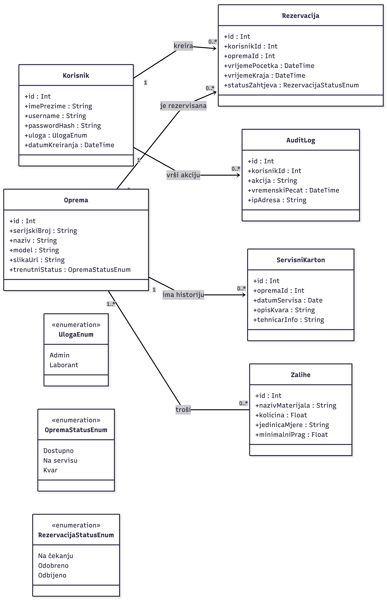

# Domain Model - Sistem za upravljanje medicinskom laboratorijskom opremom

Domain model definiše glavnu poentu sistema kroz analizu ključnih objekata i njihovih međusobnih odnosa. Model je direktno izveden iz zahtjeva definisanih u **[Product Backlogu](../Sprint%202/product_backlog_v2.md)**, sa posebnim fokusom na integritet podataka u medicinskom laboratorijskom okruženju. Ukratko to je “mapa” svih važnih stvari u našoj aplikaciji i prikaz kako su povezane.

## Glavni entiteti (Domain Entities)

Na osnovu funkcionalnih potreba laboratorije, identifikovani su sljedeći osnovni entiteti:

1. **Korisnik (User):** Glavni entitet za upravljanje pristupom. Obuhvata laborante i administratore (šefove laboratorije).
2. **Medicinska Oprema (Equipment):** Predstavlja fizičke resurse laboratorije (npr. analizatori, mikroskopi).
3. **Rezervacija (Reservation):** Ključni procesni entitet koji definiše zauzeće opreme u datom trenutku / određenom vremenu.
4. **Repromaterijal (Inventory/Supplies):** Prati fizičke resurse koji se troše prilikom rada sa opremom.
5. **Dnevnik Aktivnosti (Audit Log):** Digitalni trag svih aktivnosti, što je ključno za sigurnost i naknadnu provjeru laboratorijskih radnji.
6. **Servisni Karton (Maintenance Record):** Bilježi historiju kvarova i održavanja instrumenata.

## Ključni atributi

U tabeli ispod su navedeni najbitniji podaci koje svaki entitet mora čuvati:

| Entitet | Ključni atributi |
| :--- | :--- |
| **Korisnik** | korisnicko_ime, lozinka_hash, uloga (Admin/Laborant), email, datum_kreiranja |
| **Oprema** | serijski_broj, naziv, model, trenutni_status (Dostupno/Servis), lokacija |
| **Rezervacija** | vrijeme_pocetka, vrijeme_kraja, status_zahtjeva (Na čekanju/Odobreno), id_korisnika, id_opreme |
| **Repromaterijal** | naziv_materijala, kolicina_na_stanju, mjerna_jedinica, minimalni_prag_zaliha |
| **Dnevnik Aktivnosti** | vrijeme_akcije, opis_promjene, id_korisnika, ip_adresa |
| **Servisni Karton** | datum_servisa, opis_kvara, cijena_popravke, tehnicar_info |

## Veze između entiteta

Logička povezanost sistema definisana je sljedećim relacijama:

* **Korisnik – Rezervacija (1:N):** Jedan laborant može kreirati neograničen broj rezervacija tokom vremena, ali svaka pojedinačna rezervacija u sistemu pripada isključivo jednom korisniku.
* **Oprema – Rezervacija (1:N):** Jedan instrument može biti predmet mnogih rezervacija u različitim terminima, ali se jedna konkretna rezervacija odnosi samo na jedan komad opreme.
* **Oprema – Servisni Karton (1:1/N):** Svaki komad opreme ima svoju historiju servisa. Veza omogućava uvid u pouzdanost uređaja kroz vrijeme.
* **Korisnik – Dnevnik Aktivnosti (1:N):** Svaka kritična akcija (brisanje opreme, odobravanje termina) vezana je za ID korisnika koji je akciju izvršio.

## Poslovna pravila važna za domain model

Ova pravila osiguravaju da sistem radi ispravno i sprječava ljudske greške (direktno vezano za **PB26** i **PB22**):

* **Pravilo validacije termina:** Sistem ne smije dozvoliti kreiranje nove rezervacije ako se `vrijeme_pocetka` ili `vrijeme_kraja` preklapa sa već postojećom odobrenom rezervacijom za tu istu opremu.
* **Pravilo dostupnosti opreme:** Rezervacija se može kreirati samo ako je status opreme postavljen na **"Dostupno"**. Ako je oprema u statusu **"Servis"**, ona se automatski izuzima iz kalendara rezervacija.
* **Pravilo minimalnih zaliha:** Prilikom evidentiranja potrošnje materijala, ako `kolicina` padne ispod `minimalni_prag_zaliha`, sistem mora označiti taj materijal kao prioritet za nabavku.
* **Pravilo autorizacije:** Samo korisnik sa ulogom **Administrator** ima pravo pristupa entitetu **Dnevnik Aktivnosti** i pravo promjene statusa u entitetu **Servisni Karton**.
* **Pravilo integriteta brisanja:** Nije dozvoljeno brisanje entiteta **Oprema** iz sistema ukoliko za nju postoje aktivne ili buduće **Rezervacije**.

## Vizuelni prikaz domene - UML dijagram klasa

*U nastavku je prikazan grafički model koji vizuelno spaja entitete, njihove atribute i međusobne relacije (1:N, M:N), čime se definiše struktura baze podataka i poslovna logika sistema.* [1]

### UML dijagram klasa i opis relacija

UML dijagram klasa služi kao vizuelni nacrt strukture podataka. On prikazuje kako se podaci transformišu kroz procese rezervacije i održavanja opreme, osiguravajući da sistem prati stroga medicinska pravila.

### Opis ključnih relacija:

* **Korisnik — Rezervacija (1 : 0..*):** Relacija pokazuje da jedan korisnik (laborant) može kreirati više rezervacija tokom vremena, dok svaka pojedinačna rezervacija mora imati tačno jednog vlasnika (odgovornu osobu).
* **Oprema — Rezervacija (1 : 0..*):** Jedan komad medicinske opreme može biti predmet mnogih rezervacija u različitim terminima. Multiplicitet na strani opreme je strogo **1**, što znači da se jedna rezervacija ne može odnositi na više aparata istovremeno.
* **Oprema — Servisni Karton (1 : 0..*):** Svaki aparat posjeduje svoju historiju održavanja. Ova relacija omogućava administratoru da prati pouzdanost uređaja i planira obavezne kalibracije.
* **Korisnik — Audit Log (1 : 0..*):** Svaka akcija u sistemu (promjena statusa, odobrenje termina) vezana je za korisnički ID. Ovo garantuje da svaka promjena podataka ima digitalni potpis, što je ključno za sigurnost u medicini.
* **Oprema — Zalihe (1..* : 0..*):** Relacija **više-prema-više (N:M)** pokazuje da jedan medicinski uređaj može trošiti više vrsta materijala (npr. različite reagenese), dok se ista vrsta materijala može koristiti na više različitih uređaja.

### Tehnička napomena o atributima:
Svi entiteti koriste jedinstvene identifikatore (**id**) kao primarne ključeve za povezivanje. Atributi su prikazani prema standardima baze podataka (npr. `String` za nazive, `DateTime` za termine, `Enum` za statuse), što omogućava precizno programiranje validacija, poput sprečavanja preklapanja termina ili automatskog upozorenja o niskim zalihama.

------------------------------------------------------------
### Autor
1. [Kemal Mešić](https://github.com/mesicc) (236-ST)

------------------------------------------------------------
### Alati korištena za ovaj .md file
[1]  Mermaid Live Editor- Official Website. Dostupno na: [Internet](https://mermaid.live/edit#pako:eNqlVV1O20AQvspqH9skip0mxBZCoqVVUaAgKC8oL4O9JOuf3Wh2nbZBOUIP0bu09-rYDokhi0xVP9je-WY83_z6gUc6FjzkUQbGnEiYIeRTxeiKJYrISq3Y2VUtqe-VJptolEbJlD3U0vJ6K2MWslNlm6JcXKJY0YOga4tSzRpoYQQqcGMLcvNNY_wZzNxpm-kZEHBTPj-qIm9gMdgin6CQCCoplU7Aiq9EotZZ78dzsUCRQ1s0RFcmJpXvUScuTgpWcukCcspy5gJMJlO4QSdmUajCKnltKRxDGjXJ-riL2BHNlVgJXEIkk9aQ0k0hT_chXblzAEvKgqDC6kjYdD-9TZ0JQvKChqniuIW5TcSy1GmwfkWMt5DJuWgLr6rIOTknOpCBK82pzmQkVYl9yjQ0rRMRSyUjOE8EOps0JziHTMlLhNnTDzgoHxextGd69h81gbQqqoPKkoolFDXnpYjAulMuF8cxCvPc3kH1mipRcpgAWloBLYRf7JRqEOtvPXbBEzNpJktAZzxWzMvU46m61_t8m1y3G6BJ8_CQhicXCOUKOzraAccxFW13PIM7TVvCtmyGXUO-ysmJNrZYKL2TfAFmqjwUO1kZ-2tm-B-dk6vfP0VKq6_h6yLWd7RPdFNyRyP6KNnmdLvZp9ybctbtHtFbv9d7Q4fmXglZWi3Y2mqzP1ttEsGwElBDKGj3uB2ZkC3xzy_JqgEo2pw-a9-Q0ZSyuTSWXO1b1zbd7s5-s1xCZlGTV97hM5QxDy0WosMp6TmUR16VY8rtnGZvykN6jQHTKZ-qNdksQN1qnT-aoS5mcx7eQ2boVCxoOMTml7uVUoligR90oSwP_aD6Bg8f-Hc6jQe9wPcGfW88Go6Cgd_hP3jo-T2v73sH437gDwfvDsb-usNXldd-bxwEQ3_oe4HX9w5GwajDaaFRDs43P_3ysf4LX2NhVA)  