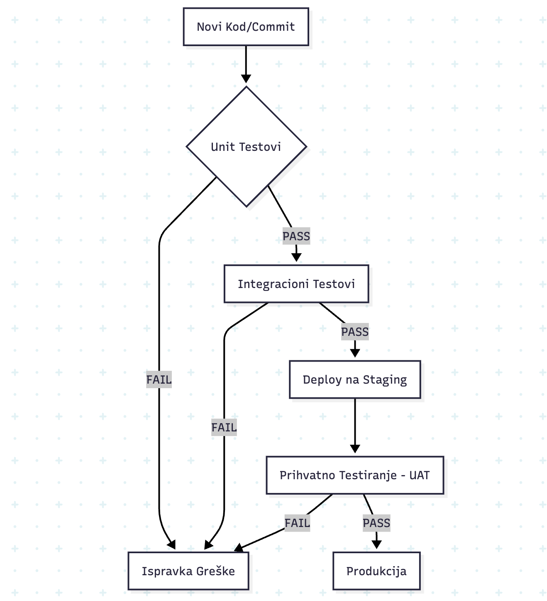

## 1. Cilj testiranja 
Glavni cilj testiranja je da sistem bude pouzdan, siguran i funkcionalan u svakodnevnom radu laboratorije. Važno je spriječiti probleme kao što su duple rezervacije, neovlašten pristup administratorskim funkcijama i netačno evidentiranje aktivnosti u sistemu. Testiranjem želimo na vrijeme uočiti greške i potvrditi da sistem radi u skladu sa definisanim zahtjevima.

### 1.1. Specifični ciljevi (Technical QA Objectives)
Osim osnovne funkcionalnosti, fokusiramo se na:
* **Integritet baze podataka:** Validacija da svaki `Equipment` entitet ispravno korelira sa svojim `Reservation` statusom.
* **RBAC (Role-Based Access Control):** Rigorozna provjera da student ne može pristupiti ruti `/api/admin/**`.
* **Concurrency Control:** Eliminacija "Race Condition" problema kod istovremenih pokušaja rezervacije istog mikroskopa ili instrumenta.
* **Data Consistency:** Osiguravanje da se prilikom otpisa materijala (Inventory) stanje u bazi ne može spustiti ispod nule.

---

## 2. Nivoi testiranja 
- **Unit testiranje**
   Ovaj nivo testiranja koristi se za provjeru pojedinačnih dijelova sistema, odnosno funkcija i logike unutar aplikacije. Fokus je na testiranju servisnih metoda (npr. u `UserService` ili `EquipmentService`) izolovanih od baze podataka koristeći Mockito.

- **Integraciono testiranje**
   Na ovom nivou provjerava se da li različiti dijelovi sistema ispravno rade zajedno, na primjer aplikacija, baza podataka i API. Ovdje verifikujemo JPA Repository upite i komunikaciju između Spring Boot kontrolera i PostgreSQL baze.

- **Sistemsko testiranje**
   Sistemsko testiranje obuhvata provjeru kompletnog sistema kao cjeline, odnosno rada svih glavnih funkcionalnosti zajedno. Testiramo cjelokupni "Business Flow" od momenta prijave na React frontend do upisa transakcije u bazu podataka.

- **Prihvatno testiranje**
   Ovaj nivo testiranja služi da se provjeri da li sistem ispunjava očekivanja korisnika i acceptance kriterije definisane za user storyje. Ovo uključuje verifikaciju od strane krajnjeg korisnika (asistent/laborant) na staging okruženju.

---

## 3. Šta se testira u kojem nivou
Na nivou unit testiranja pažnja je usmjerena na pojedinačne dijelove sistema. Tu se provjerava da li osnovne funkcije rade ispravno same za sebe, bez uticaja drugih dijelova aplikacije. To uključuje prijavu korisnika, provjeru korisničkih uloga, validaciju rezervacija, kao i funkcije za pretragu i filtriranje opreme.

Kod integracionog testiranja fokus je na tome da različiti dijelovi sistema pravilno sarađuju. Ovdje je važno provjeriti da li se podaci ispravno prenose između aplikacije, baze podataka i ostalih dijelova sistema. Na ovom nivou testiraju se tokovi kao što su rezervacija opreme, odobravanje rezervacija, promjena statusa opreme i razmjena podataka između korisničkog interfejsa i baze.

Sistemsko testiranje obuhvata rad sistema kao cjeline. Tu se provjerava kako sve glavne funkcionalnosti rade zajedno u realnim uslovima korištenja. Posebna pažnja se posvećuje funkcijama kao što su pregled opreme, rezervacije, kalendar zauzeća, notifikacije i upravljanje opremom, kako bi se potvrdilo da sistem kao cjelina radi stabilno i logično.

Na kraju, kroz prihvatno testiranje provjerava se da li su funkcionalnosti sistema usklađene sa acceptance kriterijima definisanim za user storyje. Cilj ovog nivoa testiranja je potvrditi da sistem ispunjava ono što je planirano i da su funkcionalnosti spremne za korištenje iz ugla krajnjeg korisnika.

### 3.1. Detaljna matrica tehničkih testova
<table>
  <thead>
    <tr style="background-color: #f2f2f2;">
      <th>Modul</th>
      <th>Metoda Testiranja</th>
      <th>Opis Scenarija</th>
      <th>Očekivani Ishod</th>
    </tr>
  </thead>
  <tbody>
    <tr>
      <td><b>Autentifikacija</b></td>
      <td>Unit / JWT</td>
      <td>Validacija generisanja JWT tokena sa claims za ulogu STUDENT.</td>
      <td>Token sadrži ispravan "scope" i "exp" datum.</td>
    </tr>
    <tr>
      <td><b>Rezervacije</b></td>
      <td>Integration</td>
      <td>Pokušaj rezervacije u terminu koji se preklapa za 1 minutu.</td>
      <td>Baza odbija upis uz Error 409 Conflict.</td>
    </tr>
    <tr>
      <td><b>Inventar</b></td>
      <td>Unit</td>
      <td>Smanjenje zaliha materijala ispod dostupne količine.</td>
      <td>Custom Exception: "Insufficient material quantity".</td>
    </tr>
    <tr>
      <td><b>Frontend</b></td>
      <td>System (E2E)</td>
      <td>Prikaz kalendara zauzeća za selektovani laboratorijski instrument.</td>
      <td>Kalendar ispravno renderuje zauzete slotove iz baze.</td>
    </tr>
  </tbody>
</table>

---

## 4. Veza sa acceptance kriterijima (AC)

Acceptance kriteriji (Kriteriji prihvatanja) čine "ugovor" između razvojnog tima i krajnjeg korisnika. Oni predstavljaju direktnu osnovu za kreiranje testnih scenarija (Test Cases) jer precizno definišu granice funkcionalnosti. Bez ispunjenja svakog pojedinačnog AC-a, User Story se ne može smatrati završenim, bez obzira na to koliko je koda napisano.

U okviru ISOLO sistema, AC koristimo za:
* **Smanjenje dvosmislenosti:** Jasno definisanje šta sistem radi u "edge case" situacijama (npr. šta se desi kada se skenira oštećen QR kod).
* **Binarnu validaciju:** Funkcionalnost ili 100% ispunjava kriterij ili ga ne ispunjava uopšte (nema "djelimično gotovih" zadataka).
* **Automatizaciju:** Svaki AC direktno inspiriše pisanje jednog ili više integracionih testova u `Jest` okviru.

### 4.1. Mapiranje User Story-a na AC testove

Donja tabela prikazuje konkretno mapiranje ključnih User Story-ja sa vašeg repozitorija na njihove kriterije prihvatanja i trenutni status verifikacije.

<table>
  <thead>
    <tr style="background-color: #f2f2f2;">
      <th width="15%">User Story ID</th>
      <th width="25%">Opis zahtjeva (Goal)</th>
      <th width="45%">Acceptance Criterion (AC) - Tehnička verifikacija</th>
      <th width="15%">Status</th>
    </tr>
  </thead>
  <tbody>
    <tr>
      <td><b>US-01</b></td>
      <td><b>Digitalni Registar</b> Pregled i kategorizacija opreme.</td>
      <td>Sistem mora omogućiti filtriranje po tipu (npr. mikroskop, centrifuga) i laboratoriji u realnom vremenu bez ponovnog učitavanja stranice.</td>
      <td>✔ Prošlo</td>
    </tr>
    <tr>
      <td><b>US-04</b></td>
      <td><b>QR Identifikacija</b> Brzi pristup profilu uređaja.</td>
      <td>Skeniranjem koda, sistem mora otvoriti specifični URL uređaja u roku od &lt; 2s. Ako uređaj ne postoji, prikazati "404 Not Found" stranicu.</td>
      <td> U testiranju</td>
    </tr>
    <tr>
      <td><b>US-07</b></td>
      <td><b>Servisni Incidenti</b> Prijava kvara od strane laboranta.</td>
      <td>Prilikom prijave kvara, polje "Opis problema" ne smije biti prazno (min 10 karaktera) i status uređaja se mora automatski promijeniti u "U kvaru".</td>
      <td>✔ Prošlo</td>
    </tr>
    <tr>
      <td><b>US-09</b></td>
      <td><b>Notifikacije kalibracije</b> Upozorenje o isteku roka.</td>
      <td>Sistem mora poslati email obavještenje administratoru tačno 7 dana prije isteka datuma kalibracije definisanog u bazi.</td>
      <td>✘ Palo (Bug #112)</td>
    </tr>
    <tr>
      <td><b>US-12</b></td>
      <td><b>Generisanje Izvještaja</b> Izvoz istorije održavanja.</td>
      <td>Generisani PDF mora sadržavati tabelarni prikaz svih servisa, ime servisera i digitalni potpis/pečat laboratorije.</td>
      <td> Planirano</td>
    </tr>
  </tbody>
</table>

### 4.2. Proces validacije Acceptance kriterija

Da bi se osiguralo da su ovi kriteriji zaista ispunjeni, tim prati **Three Amigos** princip (Developer, QA, Product Owner):

1.  **Analiza:** Prije početka sprinta, **Elma (PO)** objašnjava AC timu kako bi se izbjegle pogrešne interpretacije.
2.  **Verifikacija:** **Iman (QA)** kreira testnu skriptu koja simulira korake opisane u AC.
3.  **Demonstracija:** Na kraju sprinta, funkcionalnost se demonstrira na *Staging* okruženju. Ako sistem ne može uspješno izvršiti filter (US-01) ili poslati notifikaciju (US-09) tačno onako kako AC nalaže, Story se vraća u razvoj.

Ovaj rigorozni pristup osigurava da ISOLO sistem ostane u potpunosti usklađen sa standardima laboratorijskog poslovanja i da svaka implementirana linija koda ima direktnu svrhu u rješavanju korisničkih potreba.

---

## 5. Način evidentiranja rezultata testiranja

Sistematsko evidentiranje rezultata je ključno za održavanje visokog nivoa kvaliteta u ISOLO sistemu. Rezultati se ne posmatraju izolovano, već se direktno mapiraju na **User Story ID** i pripadajuće **Acceptance Criteria (AC)**. Ovakav pristup omogućava tzv. *Traceability Matrix* (matricu sljedivosti) koja u svakom trenutku pokazuje procenat spremnosti projekta za produkciju.

Svaki testni zapis mora sadržavati objektivne dokaze (screenshot, log, query rezultat) kako bi se eliminisala dvosmislenost između QA i razvojnog tima.

### 5.1. Standardni format Test Reporta (Bug Log)

Svaki identifikovani propust ili devijacija od očekivanog ponašanja dokumentuje se u QA dnevniku (ili Issue Trackeru poput GitHub-a) koristeći sljedeću strukturu:

<table>
  <thead>
    <tr style="background-color: #f2f2f2;">
      <th align="left">Polje izvještaja</th>
      <th align="left">Opis i Sadržaj</th>
    </tr>
  </thead>
  <tbody>
    <tr>
      <td><b>Test Case ID</b></td>
      <td>Jedinstvena oznaka (npr. <code>TC-EQ-001</code>). Povezuje test sa specifičnim modulom (Equipment).</td>
    </tr>
    <tr>
      <td><b>Severity (Ozbiljnost)</b></td>
      <td>
        <b>Kritična (P0):</b> Pad sistema, gubitak podataka. 
        <b>Visoka (P1):</b> Funkcionalnost ne radi, nema zaobilaznice. 
        <b>Srednja (P2):</b> Funkcionalnost radi otežano. 
        <b>Niska (P3):</b> Kozmetičke greške, UI poravnanje.
      </td>
    </tr>
    <tr>
      <td><b>Status Testiranja</b></td>
      <td><code>PASSED</code>, <code>FAILED</code>, <code>BLOCKED</code> (čeka drugu funkciju) ili <code>SKIPPED</code>.</td>
    </tr>
    <tr>
      <td><b>Koraci za reprodukciju</b></td>
      <td>Precizan niz akcija:  1. Loguj se kao 'Admin'  2. Idi na 'Oprema'  3. Klikni 'Obriši' na aktivnom uređaju.</td>
    </tr>
    <tr>
      <td><b>Očekivani vs. Stvarni rezultat</b></td>
      <td><b>Očekivano:</b> Pojavljuje se upozorenje. <b>Stvarno:</b> Uređaj obrisan bez potvrde.</td>
    </tr>
    <tr>
      <td><b>Tehnički dokazi (Artifacts)</b></td>
      <td>Linkovi na screenshotove, snimke ekrana (Loom) ili izvode iz baze podataka.</td>
    </tr>
    <tr>
      <td><b>Logs & Trace</b></td>
      <td>Izvod iz <code>Node.js</code> konzole, <code>PostgreSQL</code> error logovi ili <code>Network tab</code> iz browsera.</td>
    </tr>
  </tbody>
</table>

### 5.2. Metodologija verifikacije ispravki (Bug Lifecycle)

Nakon što se rezultat evidentira kao `FAILED`, bug prolazi kroz definisani životni ciklus kako bi se osiguralo da ispravka nije narušila druge dijelove sistema:

1.  **New:** Bug je evidentiran od strane QA člana (**Iman**).
2.  **Assigned:** Tehnički vođa (**Omar**) dodjeljuje bug odgovornom developeru.
3.  **Fixed:** Developer (npr. **Ilda**) šalje kod na ponovno testiranje.
4.  **Regression Testing:** Ključni korak gdje se, pored popravljenog bug-a, ponovo testiraju povezane funkcije kako bi se osiguralo da promjena nije uzrokovala nove probleme.
5.  **Closed:** Bug se zatvara tek kada QA potvrdi ispravku u Staging okruženju.

### 5.3. Sumarni izvještaj sprinta (Quality Dashboard)

Na kraju svakog sprinta, **Iman Salanović (QA Lead)** u saradnji sa **Elmom Dedić (PO)** generiše **Quality Dashboard**. Ovaj izvještaj nije samo puka statistika, već dokument koji direktno utiče na odluku o tome da li je trenutni build spreman za deployment ili zahtijeva dodatni ciklus stabilizacije.

Izvještaj se fokusira na četiri ključna stuba kvaliteta:

#### 1. Metrike izvršenja testova (Test Execution Metrics)
Ovaj dio izvještaja prikazuje efikasnost testiranja u odnosu na planirani opseg sprinta.

<table>
  <thead>
    <tr style="background-color: #f2f2f2;">
      <th align="left">Metrika</th>
      <th align="left">Opis i Interpretacija</th>
      <th align="left">Ciljna vrijednost</th>
    </tr>
  </thead>
  <tbody>
    <tr>
      <td><b>Pass/Fail Ratio</b></td>
      <td>Procenat testnih slučajeva koji su uspješno prošli u odnosu na ukupno izvršene.</td>
      <td>> 95%</td>
    </tr>
    <tr>
      <td><b>Test Coverage</b></td>
      <td>Pokrivenost koda automatskim testovima (Jest/Istanbul). Fokus je na <i>Business Logic</i> sloju.</td>
      <td>> 80%</td>
    </tr>
    <tr>
      <td><b>Execution Rate</b></td>
      <td>Procenat planiranih testova koji su zaista stigli na red za izvršenje tokom sprinta.</td>
      <td>100%</td>
    </tr>
  </tbody>
</table>

#### 2. Analiza defekata (Defect Analysis)
Fokusira se na "zdravlje" koda po modulima. Ako jedan modul (npr. *QR Generator*) konstantno proizvodi najviše bugova, to je indikator da je potreban **Code Refactoring**.

* **Defect Density (Gustina bugova):** Broj pronađenih grešaka po broju linija koda ili po komponenti. 
    * *Primjer:* Modul "QR Skener" ima 15 bugova na 200 linija koda, što signalizira visok rizik.
* **Defect Leakage:** Broj bugova koji su prošli fazu Unit testiranja i pronađeni su tek u Integracionoj ili Sistemskoj fazi.
* **MTTR (Mean Time To Repair):** Prosječno vrijeme koje je developerima (Omar, Ilda, Kemal) potrebno da isprave potvrđeni bug.

#### 3. Stanje preostalih rizika (Open Issues & Debt)
Transparentan prikaz onoga što nije završeno:

<table>
  <thead>
    <tr style="background-color: #f2f2f2;">
      <th align="left">Kategorija</th>
      <th align="left">Opis</th>
      <th align="left">Akcija</th>
    </tr>
  </thead>
  <tbody>
    <tr>
      <td><b>Critical Bugs (P0)</b></td>
      <td>Blokirajući bugovi koji sprečavaju <i>Go-Live</i>.</td>
      <td>STOP deploymentu do ispravke.</td>
    </tr>
    <tr>
      <td><b>Technical Debt</b></td>
      <td>Zadaci koji su "Done" funkcionalno, ali zahtijevaju čišćenje koda (refaktoring).</td>
      <td>Prioritizacija u sljedećem backlog-u.</td>
    </tr>
    <tr>
      <td><b>Deferred Bugs</b></td>
      <td>Niskoprioritetni bugovi (npr. UI padding) koji ne utiču na rad laboratorije.</td>
      <td>Prebacivanje u Sprint Backlog +1.</td>
    </tr>
  </tbody>
</table>

#### 4. QA Zaključak i Preporuka (Sign-off)
Izvještaj se završava jasnom preporukom QA tima:
* **Green:** Sistem je stabilan, svi kritični AC su ispunjeni. Preporučen deployment.
* **Yellow:** Sistem je funkcionalan, ali postoje manji rizici. Deployment moguć uz pojačan monitoring.
* **Red:** Sistem je nestabilan. Rizik od gubitka podataka u laboratoriji je prevelik. Deployment se odgađa.

Ovaj strukturirani način izvještavanja osigurava da menadžment i klijent imaju uvid u realno stanje stabilnosti aplikacije, čime se drastično smanjuje mogućnost neprijatnih iznenađenja nakon puštanja sistema u rad.
---

## 6. Glavni rizici kvaliteta 
Glavni rizici kvaliteta u ovom sistemu odnose se na mogućnost duplih rezervacija, odnosno preklapanja termina za istu opremu, jer bi to direktno uticalo na organizaciju rada i dostupnost laboratorijskih resursa. Pored toga, važan rizik predstavlja i neispravno upravljanje dozvolama pristupa, odnosno situacija u kojoj bi korisnik bez odgovarajućih ovlaštenja mogao pristupiti administratorskim funkcijama ili mijenjati važne podatke u sistemu.

Dodatni rizici kvaliteta odnose se na mogući pad sistema i probleme sa oporavkom podataka, kao i na netačno evidentiranje stanja zaliha repromaterijala. Ako sistem ne prikazuje stvarno stanje zaliha ili ne evidentira promjene ispravno, to može dovesti do problema u svakodnevnom radu laboratorije. Zbog toga je posebno važno obratiti pažnju na tačnost rezervacija, sigurnost pristupa, pouzdanost sistema i ispravno vođenje podataka o potrošnji materijala.

### 6.2. Matrica rizika i mitigacije (Ublažavanje)
<table>
  <thead>
    <tr style="background-color: #f2f2f2;">
      <th>Opis Rizika</th>
      <th>Uticaj</th>
      <th>Strategija Ublažavanja</th>
    </tr>
  </thead>
  <tbody>
    <tr>
      <td><b>Race Condition (Rezervacije)</b></td>
      <td>Kritičan</td>
      <td>Implementacija @Version (Optimistic Locking) u JPA.</td>
    </tr>
    <tr>
      <td><b>Curenje JWT Tokena</b></td>
      <td>Visok</td>
      <td>Postavljanje kratkog vijeka trajanja (Exp) i obavezan HTTPS.</td>
    </tr>
    <tr>
      <td><b>Gubitak podataka u inventaru</b></td>
      <td>Srednji</td>
      <td>Audit tabele koje bilježe svaku promjenu (History Log).</td>
    </tr>
  </tbody>
</table>

---

## 7. Vizuelni prikaz testnog toka (Mermaid Dijagram)

### 7.1. Detaljno objašnjenje faza dijagrama

Proces testiranja unutar ISOLO sistema prati strogo definisane korake koji minimiziraju rizik od ljudske greške:

1.  **Faza implementacije (Local Development):**
    * Svaki programer (npr. **Ilda** ili **Harun**) piše kod za novi modul na svojoj lokalnoj mašini.
    * **Unit Testing:** Prije slanja koda na server, izvršavaju se `Jest` testovi za izolovanu logiku (npr. validacija formata serijskog broja). Ako testovi padnu, kod se ne smije "commit-ovati".

2.  **Faza integracije (Continuous Integration - CI):**
    * Slanjem koda na GitHub (Pull Request), automatski se aktivira **GitHub Actions** pipeline.
    * **Automated Integration Tests:** Sistem automatski podiže privremenu bazu podataka i provjerava komunikaciju između kontrolera i PostgreSQL-a.
    * **Static Analysis:** Pokreće se `ESLint` koji provjerava da li kod prati timske standarde pisanja (Clean Code).

3.  **Faza manuelne verifikacije (Peer Review & QA):**
    * Nakon što automatika prođe, **Omar** ili **Kemal** vrše manuelni pregled koda.
    * **Iman (QA Lead)** preuzima granu na *Staging* serveru i vrši testiranje u realnim uslovima (npr. testiranje skenera na različitim modelima telefona i pri slabom osvjetljenju).

4.  **Faza prihvatanja (UAT & Go-Live):**
    * Zadnja instanca je **Elma (Product Owner)** koja potvrđuje da funkcionalnost ispunjava biznis potrebe laboratorije.
    * Ukoliko se u bilo kojem koraku detektuje problem, proces se vraća na početak (Red Loop). Tek nakon finalnog odobrenja, vrši se *Merge* u `main` granu.

### 7.2. Tabela protoka testnih informacija

<table>
  <thead>
    <tr style="background-color: #f2f2f2;">
      <th align="left">Korak toka</th>
      <th align="left">Odgovorna osoba</th>
      <th align="left">Artefakt (Izlaz)</th>
      <th align="left">Alat / Tehnologija</th>
    </tr>
  </thead>
  <tbody>
    <tr>
      <td><b>Local Dev</b></td>
      <td>Developer (Indiv.)</td>
      <td>Unit Test Report</td>
      <td>Jest / Vitest</td>
    </tr>
    <tr>
      <td><b>CI Pipeline</b></td>
      <td>Amina (DevOps)</td>
      <td>Build Status (Pass/Fail)</td>
      <td>GitHub Actions</td>
    </tr>
    <tr>
      <td><b>Manual QA</b></td>
      <td>Iman (QA Lead)</td>
      <td>Bug Report / Bug Log</td>
      <td>Postman / DevTools</td>
    </tr>
    <tr>
      <td><b>UAT</b></td>
      <td>Elma (PO)</td>
      <td>Sign-off dokument</td>
      <td>Jira / Trello</td>
    </tr>
  </tbody>
</table>

### 7.3. Povratna sprega i mitigacija (Feedback Loop)
Važan element ovog toka je **automatska povratna sprega**. Ako integracioni testovi padnu u CI fazi, programer odmah dobija notifikaciju i deployment je blokiran. Ovim osiguravamo da je glavna grana (`main`) uvijek u stabilnom i provjerenom stanju, što je ključno za laboratorijski sistem koji ne trpi neplanirane zastoje.